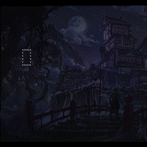

# Terminal-drawing

This is a library designed to help drawing in the terminal. You use _Points_ on the screen, which correlate to the
lines and columns of the terminal. Designed to work similarly to how you would use JavaScript to draw in a canvas.
It implements Bresenham's line algorithm for drawing lines and uses the Midpoint circle algorithm to draw circles.

## How to use

The only modules you will want to use from this library are the `cursor` and `shapes` modules.
Also, as a preface, anything that starts with an underscore(_) is for use inside the module's creation and isn't
innteded for general use. You should understand what it does and why it does it to use them.

To get started, you should create an instance of the `Cursor` class from the cursor module.
This will do the writing onto the screen and controlling the terminal. Most of the method names are self
explanatory, but to note some quirks

* `Cursor.cursor_invisible` **_must_** be used inside of any loops you use, otherwise the cursor will not
stay invisible.
* `Cursor.place_point` and `Cursor.set_pos` are generally intended for inner-module use, unless you have a specific reason
to use them, the module takes care of these tasks within other methods.
* `Cursor.cursor_visible` should be used at the very end of the program, otherwise the cursor will stay invisible.
* I use `Cursor.return_home` at the end of the program in order to not mess with the drawing and reset the prompt to
the top of the terminal.

As for the shapes, the `Point` class as the coordinates for drawing stuff with Cursor.draw_*. Otherwise the
shapes can be used for making custom shapes. You can take a look at test.py for an example ship class and how
you could draw with it. It'd probably be helpful for drawing to feed a `Class.list_points()` into the
`Cursor.place_points` function. From there you could add methods for moving things left and right to
make working with objects easier.

## Something to note

The terminal (generally) is going to be more "characters" long then it will be tall. This means sometimes when trying to draw
things, they could possibly look funny.
